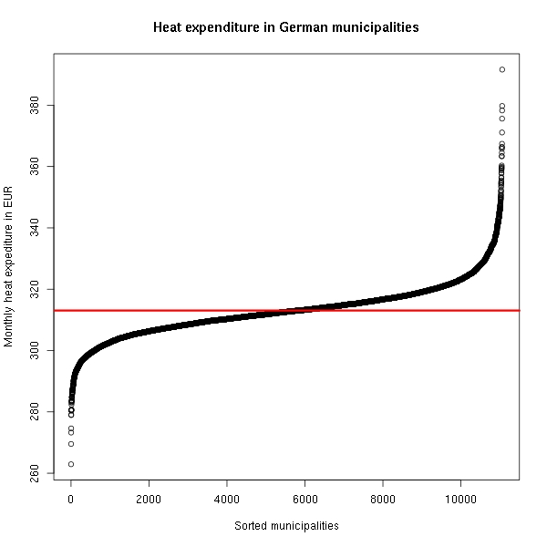
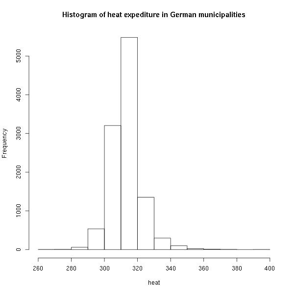
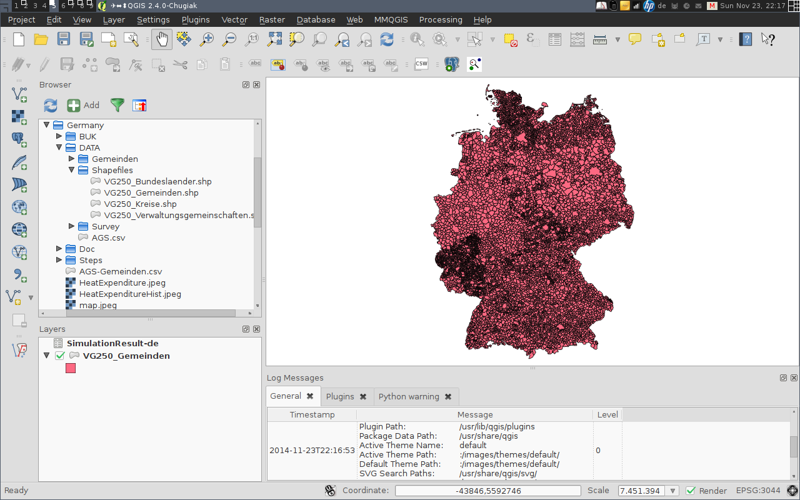
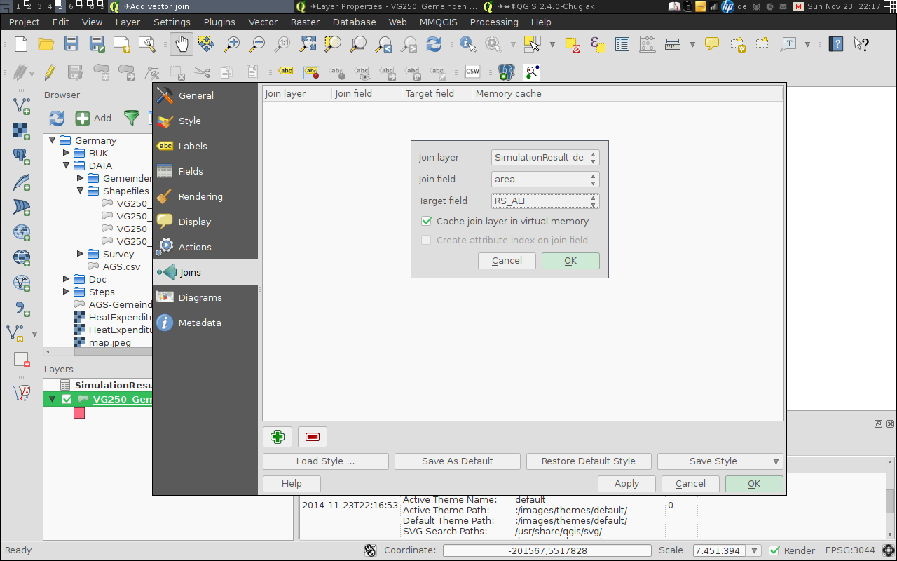
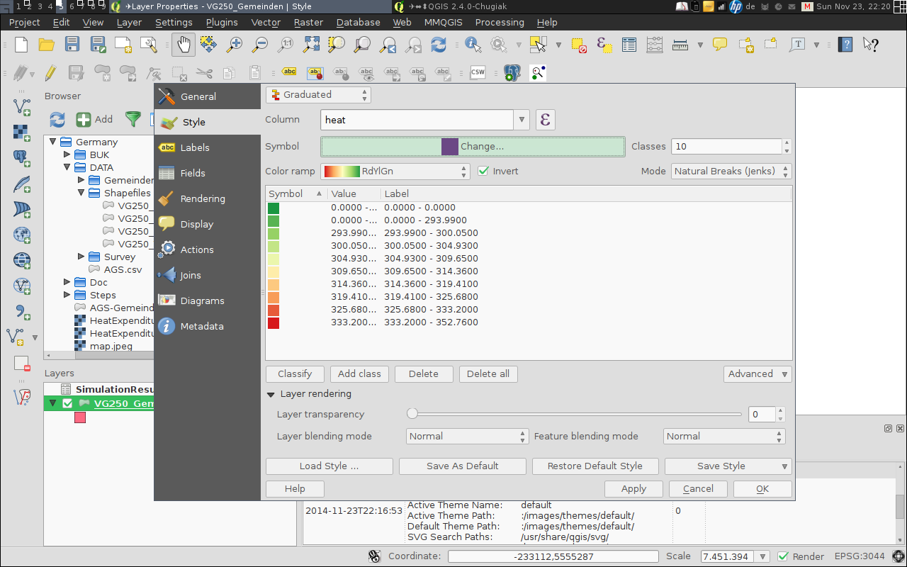
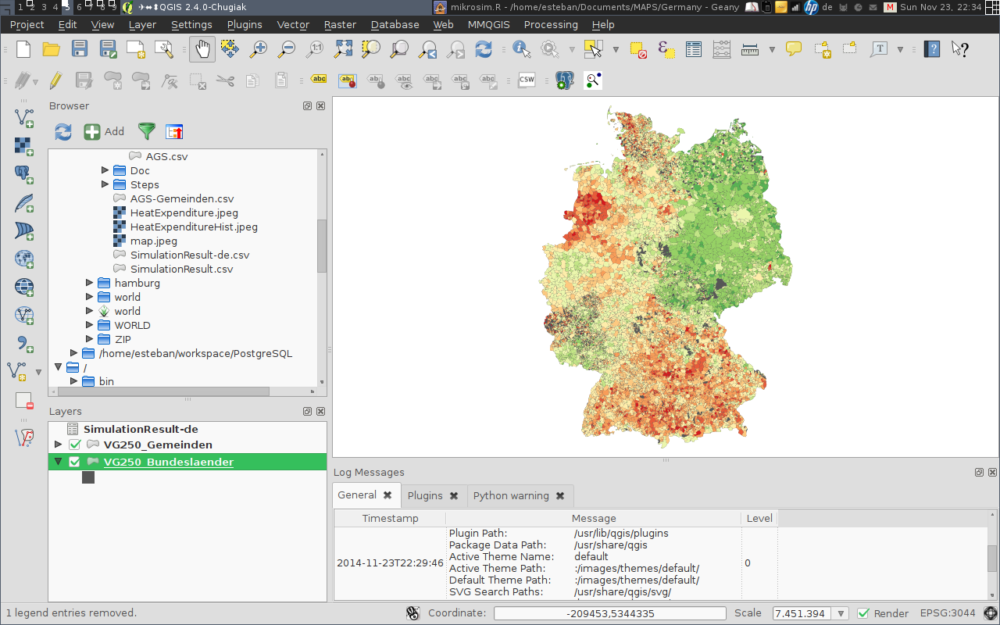
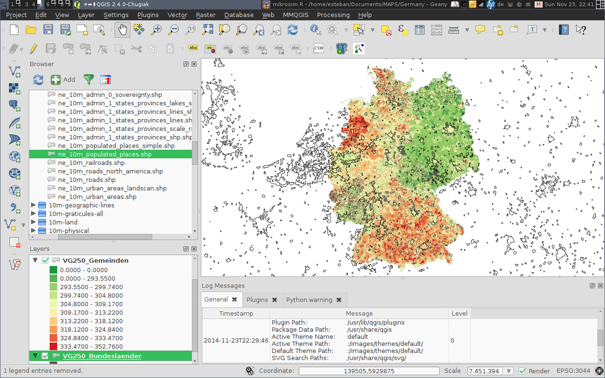
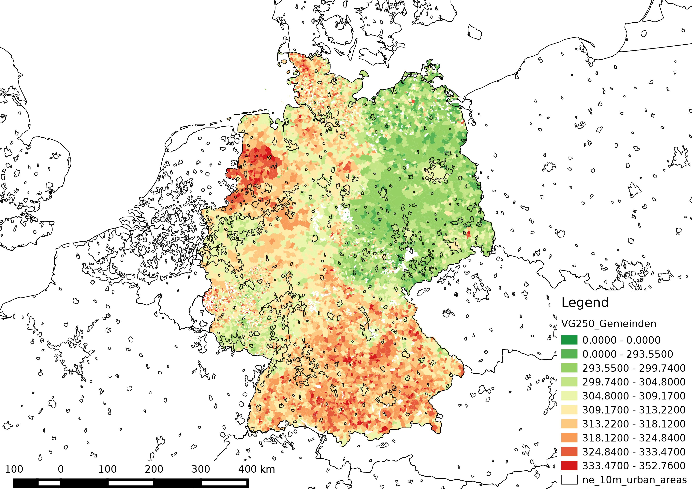
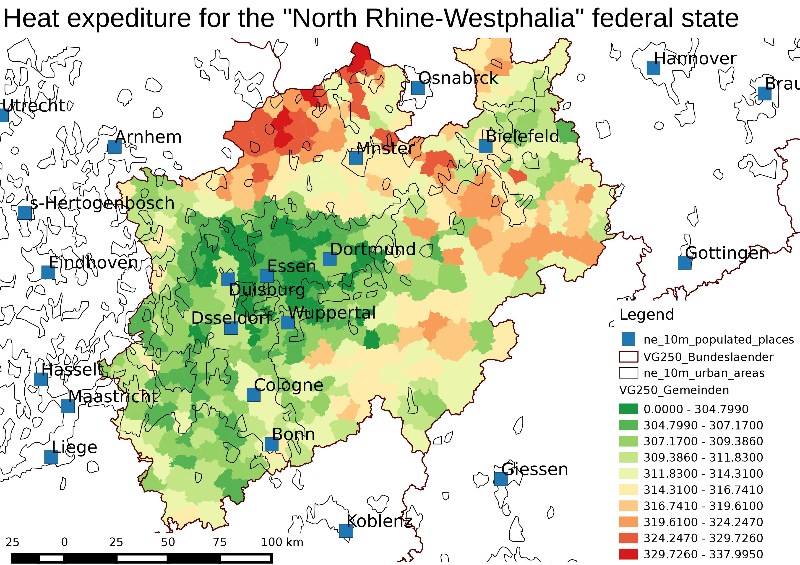

====================================================
Spatial Microsimulation: an Example with German Data 
====================================================

:Author: Esteban Munoz emunozh@gmail.com
:Date: Friday 5th December, 2014
:Prepared for: The AURIN/NATSEM Microsimulation Symposium 

.. contents:: Table of Contents
   :depth: 2

What you need to run this simulation
====================================

In order to run this simulation you need:

1. A working version of R. This simulation was tested with version 3.1.1
   (2014-07-10) on a 64-bit linux-gnu machine.

2. The simulation requires 2 additional R packages: MASS and GREGWT. The first
   library is available at the cran repositories [#]_ : 

   You can install the MASS library with this command::

       install.packages("MASS", dependencies = TRUE)
   
   In this simulation I use version 7.3-33 of the MASS library. 

   The second library is currently under development and can't be downloaded
   from the cran repository. In order to get this library you will have to
   install the library 'from source'. You will need to download the source code
   from the provided link (see data_ below) and type the following command on
   the R command line::

       install.packages("C:\\GREGWT_1.4.tar.gz", repos=NULL, type="source")

3. Two datasets: a) the census data from the last available census (2011) for
   the desire simulation region; and b) the micro census survey, this survey is
   only available, without any restriction, for the year 2002.

   The census data can be downloaded from the official census website [#]_
   maintain by the Federal Statistics Bureau of Germany (Statistische Ämter des
   Bundes und der Länder). Nonetheless, the data has to be downloaded manually
   where the input of every single area has to be explicitly given as a
   variable. I wrote a small script that automatize this process (see `Annex:
   Scripts to fetch the required data from the internet`_).  You can download
   the extracted data from the links provided below.

   The micro census survey can be downloaded from the research data center [#]_
   also maintain by the Federal Statistics Bureau of Germany. This data set can
   be downloaded in different file formats, I will use the `*.csv` file
   format.

4. The Federal Statistics Bureau also provides a shape file `*.shp` for the
   visualization of data.

5. A GIS system that can open shape files and merge a csv file to the file. In
   this example I use QGIS [#]_, this is an open source, platform independent
   GIS system. In this example I use QGIS version 2.6. 

.. _data: 

Getting the data and scripts to run the simulation
==================================================

In order to facilitate the work flow of this example I distinguished the files
between '[Required]' and '[Optional]'. I recommend you to start downloading and
decompressing the '[Required]' folders. For the rest of the exercise I assume
that all data is stores in a sub folder (Relative to the main script
'mikrosim.R') called 'Data'. If you have (or want) a different folder structure
you need to edit the contents of the 'mikrosim.R' script accordingly. 

Alternative to the download links provided below the entire folder structure
can be 'cloned' from a gitlab [#]_ repository::

    # ssh
    git clone git@gitlab.com:emunozh/mikrosim.git
    # or http
    git clone https://gitlab.com/emunozh/mikrosim.git

GREGWT [Required]
    https://www.dropbox.com/s/l3n0gzl7s4a2zpy/GREGWT_1.4.tar.gz?dl=0

GREGWT-manual.pdf [Optional]
    https://www.dropbox.com/s/w938dg0jcgae2cl/GREGWT-manual.pdf?dl=0

mikrosim.R [Required]
    https://www.dropbox.com/s/hepy3xr8qdnbotl/mikrosim.R?dl=0

Data [Required]
    https://www.dropbox.com/s/ch62zxnmel8zwa4/Data.zip?dl=0

MikrosimDoc [This document]
    https://www.dropbox.com/s/ul3w1ge0unh5sun/MikrosimDoc.pdf?dl=0

Steps [Optional]
    https://www.dropbox.com/s/v6gglw5y2lwdsjo/Steps.zip?dl=0

Doc [Optional]
    https://www.dropbox.com/s/2e03f9bvwy6z9vp/Doc.zip?dl=0

Extra [Optional]
    https://www.dropbox.com/s/1uie7iaicvpticd/Extra.zip?dl=0

Assumed folder structure of the downloaded zip files::

    ./--> mikrosim.R [Required]
    ./--> GREGWT_1.4.tar.gz [Required]
    ./--> GREGWT-manual.pdf [Optional]
    ./--> MikrosimDoc.pdf [This file] 
    ./--> MikrosimDoc.rst [Optional]

    ./Data/ [Required]
        |
        +--> Gemeinden/
        |       |
        |       +--> ALTER_AF-all.csv
        |       +--> FAMSTND_KURZ-all.csv
        |       +--> HHGROESS_KLASS-all.csv
        |
        +--> Survey/
        |       |
        |       +--> mz02_cf.csv
        |
        +--> Shapefiles/
                |
                +--> VG250_Gemeinden.shp .dfb .prj .shx

    ./Steps/ [Optional]
        |
        +--> 01.RData
        +--> 02.RData
        +--> 03.RData
        +--> de.RData
        +--> SimulationResult.csv
        +--> SimulationResult-de.csv

    ./Doc/ [Optional]
        |
        +--> Datensatzbeschreibung.pdf
        +--> fdz_mikrozensus_cf_2002_schluesselverzeichnis.pdf
        +--> HeatExpenditure.jpeg
        +--> HeatExpenditureHist.jpeg
        +--> map.jpeg 
        +--> map-de.jpeg 
        +--> Screenshot1.png
        +--> Screenshot1-1.png
        +--> Screenshot2.png
        +--> Screenshot2-1.png
        +--> Screenshot3.png
        +--> Screenshot3-1.png
        +--> Screenshot4.png
        +--> Screenshot5.png
        +--> Screenshot6.png

    ./Extra/ [Optional]
        |
        +--> AGS.csv
        +--> AGS-Gemeinden.csv
        +--> cleanAGS.py
        +--> getData.sh

Data Stucture of the Census 2011 and the Micro census 2002
==========================================================

The following section briefly describes the data structure of both datasets:
the Census 2011 and the Micro Census Survey 2002. Both datasets have to be
modify so that I can run a simulation.

The following tables compare the values or categories of the both data sets and
makes a first approach to homogenize the data structure of both data sets. 

The modification of the data format is implemented in the R language and is
part of the 'mikrosim.R' script. This process is described below under:
`Rearrange the data to fit the Census`_.

For this simulation I use three constrains:
(1) Age Distribution, with 11 classes; 
(2) Marital Status, with 4 classes; and
(3) Household Size, with 6 classes.
In order to run the simulation I have to prepare the data for each one of this
constrains. 

Age
---

+-----------------+-----------------------+
| **Census 2011** | **Micro census 2002** |
+-----------------+-----------------------+
| Under.3         | [0 ... 94]            |
+-----------------+-----------------------+
| X3...5          |                       |
+-----------------+-----------------------+
| X6...14         |                       |
+-----------------+-----------------------+
| X15...17        |                       |
+-----------------+-----------------------+
| X18...24        |                       |
+-----------------+-----------------------+
| X25...29        |                       |
+-----------------+-----------------------+
| X30...39        |                       |
+-----------------+-----------------------+
| X40...49        |                       |
+-----------------+-----------------------+
| X50...64        |                       |
+-----------------+-----------------------+
| X65...74        |                       |
+-----------------+-----------------------+
| X75.and.over    |                       |
+-----------------+-----------------------+
|                 | 95 (>= 95)            |
+-----------------+-----------------------+

Marital status
--------------

+-----------------+----------------------------+
| **Census 2011** | **Micro census 2002**      |
+-----------------+----------------------------+
| Single          | 1 (Ledig -- Single)        |
+-----------------+----------------------------+
| Married ...     | 2 (Verheiratet -- Married) |
+-----------------+----------------------------+
| Widowed ...     | 3 (Verwitwet -- Widowed)   |
+-----------------+----------------------------+
| Divorced ...    | 4 (Geschieden -- Divorced) |
+-----------------+----------------------------+
| No.Data         |                            |
+-----------------+----------------------------+

Household size
--------------

+------------------+-----------------------+
| **Census 2011**  | **Micro census 2002** |
+------------------+-----------------------+
| 1.person         | [1...8]               |
+------------------+-----------------------+
| 2.persons        |                       |
+------------------+-----------------------+
| 3.persons        |                       |
+------------------+-----------------------+
| 4.persons        |                       |
+------------------+-----------------------+
| 5.persons        |                       |
+------------------+-----------------------+
| 6.or.more.people |                       |
+------------------+-----------------------+
|                  | >= 9                  |
+------------------+-----------------------+
|                  | 0 (Other)             |
+------------------+-----------------------+

Running the Simulation
======================

In the following section I will make a short description of the require
simulation steps and comment the most important lines of code used in the
corresponding step. I have separated the steps into 9 steps:

1. Loading the micro census survey data, and selecting the needed columns

2. Rearranging the micro census to fit the census data structure

3. Loading the census data, and merging them into a single data frame

4. Select the region I want to simulate

5. Remove some unwanted records from the data sets

6. Prepare the data using for the simulation with the provided function
   'prepareData'

7. Compute the new weights for each area

8. Save the simulation result into a csv file

9. Make some plots with the results

Load the micro census survey data
---------------------------------

The micro census data is a big file with a lot of information, for this
simulation I require just a tiny fraction of this data. The easiest way to do
this is to define the columns I want to keep (code line 4-8) and create a new
data frame just with this columns. The column names in this data frame are
coded. The variables codes are provided in the documentation of this file. If
you download the zip file called 'Doc.zip' you will find this documentation
under './Doc/fdz_mikrozensus_cf_2002_schluesselverzeichnis.pdf' 

Here I also define a data frame with the two values I want to use for the
estimation of heat expenditure (ef464 and ef466). This two values represent the
'cold operating cost' and the 'warm operating cost' of the individuals in this
data set. The 'cold operating cost' is the cost to operate a dwelling unit
without heating and the 'warm operating cost' represents the 'total' operating
cost of the dwelling unit, this means including heating of the dwelling unit.
We can calculate the heating cost by subtracting the 'cold' from the 'warm
operating cost' (code line 20). 

In this data set the codes: 8, 9998 and 9999 have a special meaning. We need to
change this values, otherwise R will interpret them as numerical values (code
lines 14-19). E.g: the code 9998 represents an operating cost between 0401 and
9998 EUR. For this example I simple attribute the value 450 EUR to all cases
with an operating cost between that range. 

Finally I take only complete observations, this is important as the original
data set contains many gaps regarding the heat expenditure.  

::

    mikro.raw = read.csv("./Data/Survey/mz02_cf.csv", sep=";")
    # columns to keep for simulation:
    # age, marital status, household size, weights
    keep.simulation = c(
        "ef30",   # Age 
        "ef35",   # Marital status
        "ef521",  # Household size
        "ef750")  # Weights
    mikro.simulation <- mikro.raw[names(mikro.raw) %in% keep.simulation]
    # columns to keep for result:
    # cold operating cost, warm operating cost
    keep.result = c("ef464", "ef466")
    mikro.result <- mikro.raw[names(mikro.raw) %in% keep.result]
    mikro.result$ef464[mikro.result$ef464 == 9998]  <- 450
    mikro.result$ef464[mikro.result$ef464 == 9999]  <- NA
    mikro.result$ef464[mikro.result$ef464 == 8]     <- NA
    mikro.result$ef464[mikro.result$ef466 == 9998]  <- 450
    mikro.result$ef464[mikro.result$ef466 == 9999]  <- NA
    mikro.result$ef464[mikro.result$ef466 == 8]     <- NA
    mikro.result <- mikro.result$ef466 - mikro.result$ef464
    # remove all observations with NaN values 
    mikro.simulation <- mikro.simulation[complete.cases(mikro.result),]
    mikro.result <- mikro.result[complete.cases(mikro.result)]

Rearrange the data to fit the Census
------------------------------------

In this step I implement in code the data homogenization tables presented above
under:
`Data Stucture of the Census 2011 and the Micro census 2002`_.

This process can be described in two steps:

1. I create an empty vector (e.g: code line 3) for each class

2. I attribute a 1 to record complying with a boolean query (e.g:
   mikro.simulation$ef30 < 3, in code line 9).

Finally I merge all vectors into a single data frame, I will use this data
frame for the simulation latter on.

::

    # Age
    # Create empy vectors
    age.01 <- vector(length=dim(mikro.simulation)[1])
    age.02 <- vector(length=dim(mikro.simulation)[1])
    ...
    age.11 <- vector(length=dim(mikro.simulation)[1])

    # Fill the vectors with boolean values
    age.01[mikro.simulation$ef30 < 3] = 1
    age.02[mikro.simulation$ef30 < 6 & mikro.simulation$ef30 >= 3] = 1
    ...
    age.11[mikro.simulation$ef30 >= 75] = 1

    # Marital status
    mst.01 <- vector(length=dim(mikro.simulation)[1])
    ...
    mst.01[mikro.simulation$ef35 == 1] = 1
    ...

    # Household size
    hhs.01 <- vector(length=dim(mikro.simulation)[1])
    ...
    hhs.01[mikro.simulation$ef521 == 1] = 1
    ...

    # Put everything on a data frame
    mikro.input = data.frame(
        age.01 = age.01,
        ...
        mst.01 = mst.01,
        ...
        hhs.01 = hhs.01,
        ...
        hhs.06 = hhs.06)

    # And the vector with the weights
    dx <- mikro.simulation$ef750

Load the census data
--------------------

I have loaded and arrange the micro census survey. Now I need to load the data
from the census 2011. I have prepare three csv files, one for each constrain.
This data files can be downloaded directly in this format 
(see `Annex: Scripts to fetch the required data from the internet`_
for the developed script to download this data)

It is important to notice that I load the first column explicitly as a 
character data type (code line 3). This is important because some of the area
codes have a leading zero.

::

    nan.strings = c('nan', '.')
    gem.alt = read.csv("./Data/Gemeinden/ALTER_AF-all.csv",
        colClasses=c("character",rep("numeric",6)),
        na.strings = nan.strings)
    gem.fam = read.csv("./Data/Gemeinden/FAMSTND_KURZ-all.csv",
        colClasses=c("character",rep("numeric",6)),
        na.strings = nan.strings)
    gem.hhs = read.csv("./Data/Gemeinden/HHGROESS_KLASS-all.csv",
        colClasses=c("character",rep("numeric",7)),
        na.strings = nan.strings)

Select the state to simulate
----------------------------

The following code simply filters the areas from the census tables given the
first n letters of an area code. In this case the first two letters represent
the code for the German federal states (see table state_ below for a complete
list of the state codes). 

::

    # Select a single federal state (eg: 05 is the code for Nordrhein-Westfalen)
    AGS.code = "05"
    AGS.length = 2
    gem.alt <- gem.alt[substr(gem.alt$X,1,AGS.length)==AGS.code, ]
    gem.fam <- gem.fam[substr(gem.fam$X,1,AGS.length)==AGS.code, ]
    gem.hhs <- gem.hhs[substr(gem.hhs$X,1,AGS.length)==AGS.code, ]

.. _state:

+------------------------+----------+
| **State**              | **Code** |
+------------------------+----------+
| Schleswig-Holstein     | 01       |
+------------------------+----------+
| Hamburg                | 02       |
+------------------------+----------+
| Niedersachsen          | 03       |
+------------------------+----------+
| Bremen                 | 04       |
+------------------------+----------+
| Nordrhein-Westfalen    | 05       |
+------------------------+----------+
| Hessen                 | 06       |
+------------------------+----------+
| Rheinland-Pfalz        | 07       |
+------------------------+----------+
| Baden-Württemberg      | 08       |
+------------------------+----------+
| Bayern                 | 09       |
+------------------------+----------+
| Saarland               | 10       |
+------------------------+----------+
| Berlin                 | 11       |
+------------------------+----------+
| Brandenburg            | 12       |
+------------------------+----------+
| Mecklenburg-Vorpommern | 13       |
+------------------------+----------+
| Sachsen                | 14       |
+------------------------+----------+
| Sachsen-Anhalt         | 15       |
+------------------------+----------+
| Thüringen              | 16       |
+------------------------+----------+

Remove unwanted columns from the data
-------------------------------------

The code below simply removes some columns (code line 2-9) that I don't need
to run the simulation, merge all data frames into a single data frame (code
line 12-13) and creates a data frame to store the simulation result (code line
20-22). 

::

    # age
    drop <- c("Total")
    gem.alt <- gem.alt[,!(names(gem.alt) %in% drop)]
    # marital status
    drop <- c("Total", "No.data")
    gem.fam <- gem.fam[,!(names(gem.fam) %in% drop)]
    # Household size
    drop <- c("Total")
    gem.hhs <- gem.hhs[,!(names(gem.hhs) %in% drop)]

    # Merge all data into a big data frame
    gem.input <- merge(gem.alt, gem.fam, by.x = "X", by.y = "X")
    gem.input <- merge(gem.input, gem.hhs, by.x = "X", by.y = "X")

    # define the number of areas to run
    #areas.number = 4
    areas.number = dim(gem.input)[1]

    # create a data frame to store the result
    Result = data.frame(
        area=vector(length=areas.number),
        heat=vector(length=areas.number))

Prepare data for simulation
---------------------------

In this step I make use of the GREGWT library for the first time. In order to
run the simulation I first need to 'prepare' the data for the simulation. In
order to do this I use the provided function 'prepareData'. This function
checks for empty columns or columns with only ones, checks for collinearity
between columns, and reformats the data into matrix data types.

In the latest version of the GREGWT library I took this function out of the
main function ('GREGWT') to improve computational time as the 'GREGWT' function
is implemented in a for loop. This change means adding an extra step to the
simulation work flow but decreases redundancy in the overall process, as
otherwise I would prepare the same data in the same fashion on each for loop
iteration. 

::

    area.code <- gem.input[, 1]
    Tx.s <- gem.input[, 2:dim(gem.input)[2]]
    Simulation.Data <- prepareData(mikro.input, Tx.s)
    mikro.input.s <- Simulation.Data$X
    Tx.s <- Simulation.Data$Tx

Get the new weights for each area
---------------------------------

Finally I can run the microsimulation. For this example I will calculate the
average heat expenditure for each municipality in the selected state.

First I need to construct a for loop, iterating to all desire municipalities
(code line 2). 

The 'GREGWT' function needs 3 input variables for the estimation of new
weights (code line 8). It needs:

1. A matrix with a population sample (mikro.input.s);

2. The initial weights for this sample (dx); and

3. The 'true' population totals to which I aim to re weight the sample to.

Additionally I define as a restriction the bounds for the new weights. The
first value describes the minimum possible weight and the second value the
maximum weight an individual can take. With the bounds restriction equal to
`c(0,Inf)` I restrict the simulation to positive weights.  

I access the new weights as 'fw <- Weights$Final.Weights' (code line 9)

With this new weights I estimate the average heat expenditure for the
municipality (code line 11) and store the result in the 'Result' data frame
(code line 12). 

::

    # loop through all areas 
    for(i in seq(1, areas.number)){
        # Create a vector with the area totals
        Tx <- Tx.s[i,]
        # Store the area code
        acode <- area.code[i]
        # Get new weights with GREGWT
        Weights = GREGWT(mikro.input.s, dx, Tx, bounds=c(0,Inf))
        fw <- Weights$Final.Weights
        # Compute average heat expenditure for this area
        heat.expenditure <- sum(mikro.result * fw / sum(fw), na.rm=TRUE)
        Result[i,] <- c(acode, heat.expenditure)}

Save the result to a csv file
-----------------------------

Finally I save the result as a csv file. I will use this csv file to show the
result in a map through a GIS platform. 

::

    Result <- Result[Result$heat > 0, ]
    write.csv(Result, file="SimulationResult.csv")

Make some nice plots with the result
------------------------------------

With the estimated result I can make some nice plots.

In the first graph I simply plot the sorted heat expenditure values for all
simulated municipalities. 

::

    heat <- as.numeric(Result$heat)
    jpeg(filename="HeatExpenditure.jpeg", width=600, height=600)
    plot(sort(heat),
        main="Heat expenditure in German municipalities",
        ylab="Monthly heat expediture in EUR",
        xlab="Sorted municipalities")
    abline(h=mean(heat, na.rm=TRUE), col='red', lw=3)
    dev.off()

    **Figure 1:** Sorted heat expenditures of German municipalities

In the next graph I create an histogram on the estimated heat expenditure. 

::

    jpeg(filename="HeatExpenditureHist.jpeg", width=600, height=600)
    hist(heat, main="Histogram of heat expediture in German municipalities")
    dev.off()

    **Figure 2:** Histogram of the heat expenditure for the German
    municipalities

Visualizing the results in QGIS
===============================

In this section I will briefly explain how to visualize the result in a map. In
order to do this I took some screen shoots of my computer, this screen shots
should be self explanatory. I will simple write some comments on relevant parts
of the process. 

The first step is to load the data into the QGIS workspace. QGIS will interpret
this as layer. I load the shapefile `VG250_Gemeinden.shp` and the csv file from
the simulation, in this case `SimulationResult-de`. In order to load data to
the workspace I simply search the file in the file explores and double click
the desire data set. 

    **Figure 3:** QGIS with loaded data as layers 

Once I have loaded the shapefile and the csv file I can 'join' them. I join
them using the municipalities area codes (area and RS_ALT).

    **Figure 4:** Joining the csv file to the spatial data

Because I maintain the area codes as character data types, I have to transform
the data to a numerical data type in order to visualize it. This is easily
achieved with the 'toreal()' function. 

.. figure:: ./Doc/Screenshot3.png
    :align: center

    **Figure 5:** Convert the string values to numerical data 

With a numerical field containing the simulation result now I can create a map
using a predefine color scale. QGIS has different method to compute the breaks
in the data, the 'Natural Breaks (jenks)' method is a very common for the
visualization of this type of data. 

    **Figure 6:** Define the visualization style 

The result should look something like this. Here I add a third layer in the
background to visualize missing values (dark grey).

    **Figure 7:** Simulation result on a map 

In this step I add another layer on top of our simulation representing
populated areas.

    **Figure 8:** Adding more layers o the map 

Simulation Results
==================

You need to know a little bit of German history to interpret the result...

    **Figure 9:** Map showing the simulation result for all German states.

The influence of dense urban areas is evident at a lower scale. The cost of
heat distribution decreases as heat demand density raises.

    **Figure 10:** Map showing the result from our simulation for the state of
    North Rhine-Westphalia.

Annex: Scripts to fetch the required data from the internet
===========================================================

For the purpose of this workshop I prepare a zip file containing all the
required data to run the simulation.
If you decompress the folder you will automatically get the folder structure
describe in section `Getting the data and scripts to run the simulation`_

You can download the file under the following link.
   http://asampleurl.com

If you want to download the raw data used in the simulation just go to the
links described below. You can also find complementary information regarding
this data in these web pages. 

- The data from the census can be found under the following link 
   https://ergebnisse.zensus2011.de

- The micro census as csv file
   http://www.forschungsdatenzentrum.de/bestand/mikrozensus/cf/2002/fdz_mikrozensus_cf_2002_ascii-csv.zip

- The shapefiles for visualization
   https://www.zensus2011.de/SharedDocs/Downloads/DE/Shapefile/VG250_1Jan2011_UTM32.zip?__blob=publicationFile&v=25

Some important pieces from the file 'cleanAGS.py' are listed below.

In order to download the data from the web page I generate a url with the area
codes and the attribute I want to get. The web page has a restriction on
queering a maximum of 100 areas at the same time and therefor I have to pass
100 area codes at a time. I will download each csv file and latter on combine
them on a single file.  

::

    # divide the area codes in chunks of 100 items
    dat_AGS = chunks(AGS, 100)
    # iterate through all chunks
    for num, ags_c in enumerate(dat_AGS):
        # format the download link
        to_download = DOWNLOAD_LINK.format(ags_id=ags_c, constrain=constrain)
        # remove blank spaces from the url
        to_download = to_download.replace(" ", "")
        # create a name for the csv file
        download_name = "./Data/Gemeinden/{}-{}.csv".format(constrain, num)
        # fetch the csv file
        url.urlretrieve(to_download, filename=download_name)
        # wait 1 second to get the next file 
        sleep(1)
    return(num)

This piece of code reads the area codes and selects only the desire codes
(Gemeinden). The first line of code defines which file to open, the separator
character, the boolean value `None` to tell python that the file does not have
any header and finally define the name of the imported columns so that I can
access the data using this names. The second line select only areas
corresponding to the codes of the desire level (Gemeinden). Code lines 3 to 6
modify the code for some areas, these areas are both "Gemeinde" and "State" and
therefor have many codes representing the same area. This is important for the
latter visualization because the QGIS will not be able to identify this area
codes.

::

    _ags = pd.read_csv("./AGS.csv", sep="\t", header=None, names=['ags', 'name'])
    _clean_ags = _ags[_ags['ags'] >= 10000000000]
    _clean_ags[_clean_ags['ags'] == 20000000000] = 2     # Hamburg
    _clean_ags[_clean_ags['ags'] == 40110000000] = 4011  # Bremen
    _clean_ags[_clean_ags['ags'] == 40120000000] = 4012  # Bremerhaven
    _clean_ags[_clean_ags['ags'] == 110000000000] = 11   # Berlin
    _clean_ags.to_csv("./AGS-Gemeinden.csv")
    AGS = _clean_ags['ags'].tolist()

This piece of code reads the downloaded data from the census 2011. The first
command describe how to read the csv file. It describes:

1. The file name
2. The value separator **( ; )**
3. Number of header lines
4. Character defining **NA** values
5. Number of lines at the end of the file
6. Engine to be used to read the file. Normally I will use the default C
   engine, as this
   is faster, unfortunately the implementation of this engine doesn't have a
   notion of footer lines 
7. Which column should I use as index
8. Encoding of the file, important if I have a file with non standard
   characters.

The rest of this lines remove unwanted characters from the records. Some record
ere within brackets, indicating a manipulation in the value to avoid the
identification of individuals. The area codes in this data set do not only
contain the numerical code but also the name of the area, I removed all non
numerical characters from the area code in order to work with them. 

::

    # read the csv file
    data = pd.read_csv(
        file_name, sep=";", header=5, na_values="-",
        skip_footer=7, engine='python', index_col=index,
        encoding="latin-1")
    
    # transpose the data
    data = data.transpose()

    # reformat the data index
    new_index = data.index
    # delete all non numeric characters
    new_index = new_index.map(lambda x: re.sub('[^0-9]', '', x))
    # update the index
    data.set_index(new_index, inplace=True)

    # some records are within brackets, remove them
    for col in data.columns:
        data[col] = data[col].map(lambda x: str(x).lstrip('(').rstrip(')'))

    return(data)

.. [#] http://cran.r-project.org/web/packages/MASS/
.. [#] https://www.zensus2011.de
.. [#] http://www.forschungsdatenzentrum.de
.. [#] http://qgis.org
.. [#] https://gitlab.com/emunozh/mikrosim
